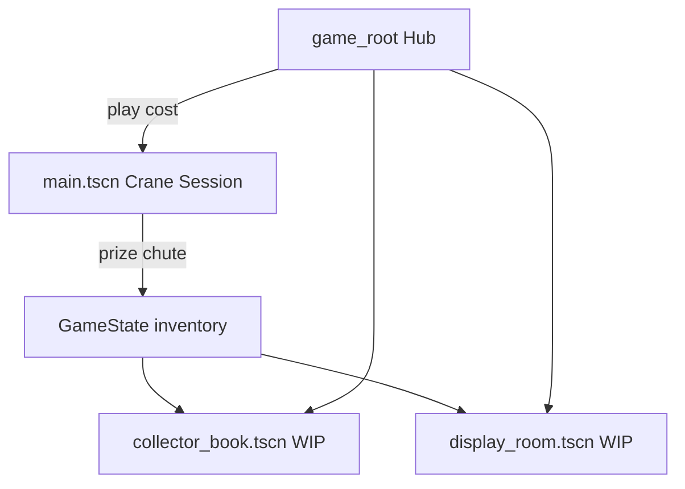

# Development Roadmap

Links: [[Places]] · [[Crane Machine]] · [[Prize]]

## Current prototype (done)

- Physics claw with payout probability and weak/strong grip
- Prize pile spawner and chute scoring
- Single cabinet scene (`main.tscn`)

## Phase 1 — Meta loop (in progress)

**Goal:** Wins persist; player moves between hub and crane.

| Piece | Location |
| --- | --- |
| Prize / pack / machine `Resource`s | `scripts/data/` |
| Starter content | `scripts/content/starter_content.gd` |
| Inventory & coins | `GameState` autoload |
| Signals | `GameEvents` autoload |
| Hub scene | `scenes/game_root.tscn` |
| Prize identity on physics bodies | `scripts/components/prize_pickup.gd` |

**Next:** Save/load (`user://save.json`), play cost on drop (wired in claw).

## Phase 2 — Collector book

- UI scene listing `GameState.inventory` with sort (acquired, name, rarity)
- Show `# owned` per [[Prize]] metadata
- Recycle → tokens (stub economy)

## Phase 3 — Display / room

- 2D sticker-style board (see [[Places#Feature Design: Display Area]])
- Tabs: Bag / Inventory / Storage
- Place, rotate, layer, lock, presets
- Deco prizes from `PrizeCategory.DECORATION`

## Phase 4 — Multiple machines

- Own / purchase machines (idle sim optional)
- Per-machine coin currency
- Machine → scene path + pack list ([[Crane Machine]])
- DLC packs as additional `PackDefinition` resources

## Phase 5 — Live ops & polish

- Daily quests & achievements
- ASMR audio layer
- Backend stats (transparent opt-in)
- Steam Deck / Workshop (optional)

## Architecture sketch



## Folder convention

```
scripts/
  autoload/     # GameState, GameEvents
  data/         # Resource definitions
  content/      # Built-in packs & machines
  components/   # PrizePickup, future DecoItem
scenes/         # Hub, future UI scenes
main.tscn       # Crane cabinet (until split to scenes/crane/)
obsidian/       # Design notes (source of truth for features)
```
